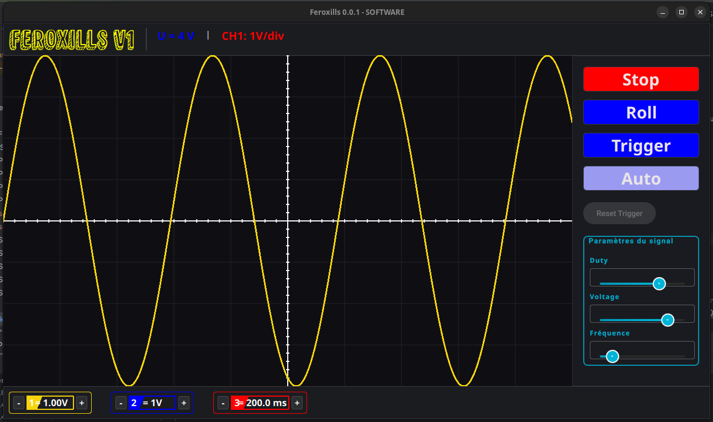

# Feroxills

Multi-source software oscilloscope, written in C++/Qt6 (QML).

It allows visualizing signals from different sources (internal generator, serial port, ...) with several display modes (continuous, trigger, auto).



## Current features

- Signal display in Continuous, Trigger and Auto modes
- Test signal generation (adjustable frequency, voltage)
- Serial port detection
- Custom QML interface

## Requirements

- Qt 6.5+ (modules `Quick`, `QuickControls2`, `SerialPort`, `Test`)
- CMake 3.16+
- C++17 compiler

## Build

```bash
cmake -B build -S .
cmake --build build
```

## Status

Actively under development. See `Issues.txt` and `features.txt` for ongoing and upcoming work.